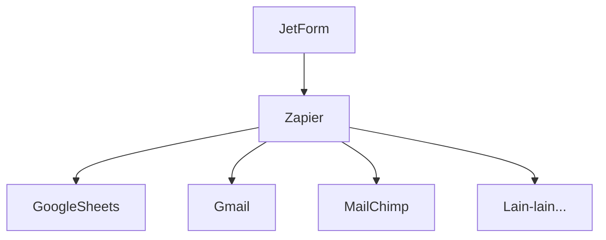

# JetForm + Zapier

Ini adalah repositori integrasi [JetForm](https://www.jetform.me) dengan [Zapier](https://zapier.com/) melalui ZAP.

> Silahkan baca selengkapnya bagaimana Zapier dan ZAP bekerja: https://platform.zapier.com/quickstart/how-zapier-works

Integrasi ini memungkinkan **JetForm diintegrasikan dengan ribuan aplikasi atau platform yang didukung oleh Zapier** sehingga JetForm tidak perlu membuat integrasi sendiri.

> Kalau bisa dipermudah, ngapain dipersulit? betul bukan 😜

**Apa saja yang bisa kita lakukan dengan integrasi ini? banyak**. Misalnya:

- Ketika ada order baru, simpan data order tersebut ke Google Sheets
- Ketika ada order baru, simpan data pembeli ke daftar email di MailChimp atau MailerLite
- Ketika ada order baru, kirim email ke alamat tertentu dengan pesan "Ada order bos!!! 🎉"
- dan masih banyak lagi, selama platform tersebut didukung oleh Zapier.

Visualisasi sederhana integrasi JetForm melalui Zapier sebagai berikut.



### 👉 Trigger dan Action

Zapier punya konsep yang namanya Trigger dan Action.

**Trigger** adalah sebuah kondisi tertentu yang baru terjadi, misalnya: order baru. Sedangkan **Action** adalah aksi yang terjadi ketika ada trigger (pemantik).

**Analogi:**
```
Trigger : Dicolek
Action  : Tonjok!
Maka aksi Tonjok! hanya akan kita lakukan ketika kita Dicolek.
```

JetForm, untuk sementara hanya mendukung Trigger "Order Created". Yang artinya, kita bisa melakukan action ketika ada order baru terhadap produk kita.

**Seperti contoh diatas:** Ketika ada order baru (**trigger**), _maka_ simpan data order tersebut ke Google Sheets (**action**).

### 👉 Cara Menggunakan

Untuk sementara, integrasi masih dalam status privat, artinya ZAP JetForm belum bisa ditemukan pada daftar integrasi resmi Zapier.

Namun demikian, pengguna JetForm bisa menggunakannya melalui link invite berikut:

🚀🚀🚀 https://zapier.com/developer/public-invite/200520/e61f56ad57a474ac7a499656f1f783e2/ 🚀🚀🚀

### 👉 Pengembangan

Untuk detail lebih lanjut tentang cara membuat dan mengembangkan ZAP, silahkan baca halaman berikut: https://platform.zapier.com/
